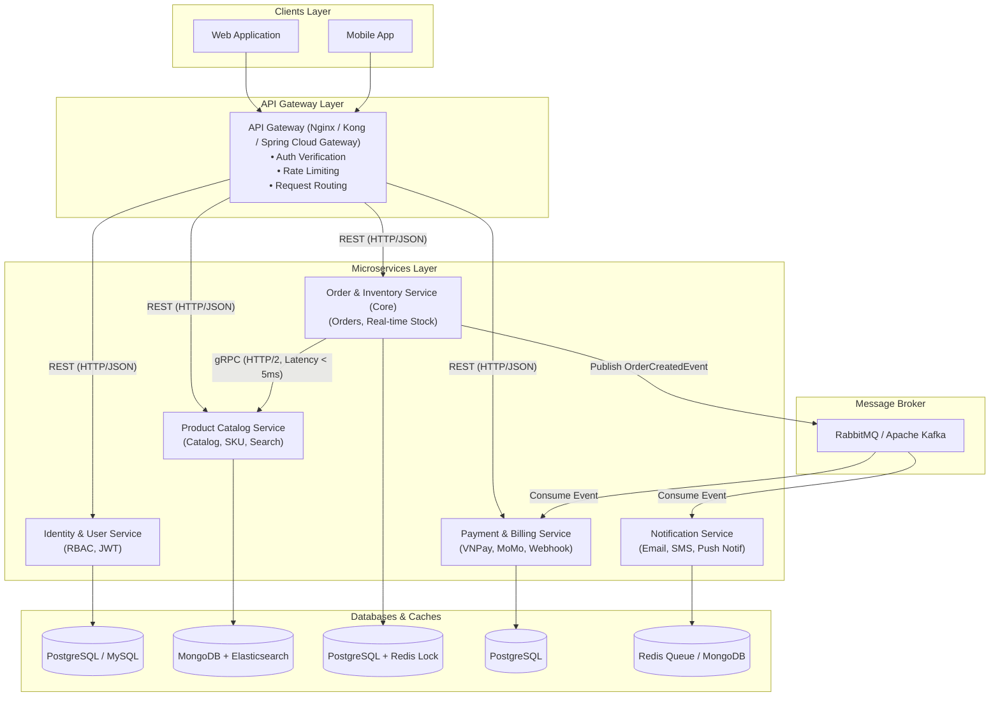

# ĐỀ TÀI 1: HỆ THỐNG THƯƠNG MẠI ĐIỆN TỬ ĐA KÊNH CHUẨN DOANH NGHIỆP (OMNICHANNEL E-COMMERCE PLATFORM)

---

## 1. TỔNG QUAN VỀ ĐỀ TÀI

* **Tên đề tài:** Thiết kế, xây dựng và triển khai hệ thống Thương mại Điện tử Đa kênh theo kiến trúc Microservices.
* **Mô tả:** Hệ thống quản lý toàn bộ quy trình mua bán hàng trực tuyến, bao gồm quản lý sản phẩm, đơn hàng, tồn kho, thanh toán, thông báo và hỗ trợ xử lý lượng truy cập lớn trong các đợt Flash Sale.
* **Tính thực tế doanh nghiệp:**
  * Các doanh nghiệp bán lẻ (Tiki, Shopee, Lazada, hoặc chuỗi cửa hàng bán lẻ) đều bắt buộc chuyển dịch từ Monolith sang Microservices để xử lý bài toán nghẽn đơn hàng khi Flash Sale.
  * Tách biệt tính năng giúp các đội ngũ dev hoạt động độc lập (đội làm Payment không ảnh hưởng đến đội làm Product Catalog).
  * Tối ưu chi phí hạ tầng bằng cách chỉ scale (mở rộng) các service bị tải cao (như Order & Inventory Service) thay vì scale toàn bộ hệ thống.

---

## 2. PHÂN TÍCH KIẾN TRÚC MICROSERVICES

### 2.1. Danh sách các Microservices chính

| Service | Vai trò chính | Công nghệ & Database đề xuất |
| :--- | :--- | :--- |
| **API Gateway** | Điểm lối vào duy nhất (Single Point of Entry) cho Client (Web/Mobile App). Xác thực (Auth Token Verification), Rate Limiting (chống DDoS/Spam), Routing request. | Nginx / Kong / Spring Cloud Gateway |
| **Identity & User Service** | Quản lý thông tin người dùng, tài khoản, địa chỉ giao hàng, phân quyền (RBAC). Quản lý JWT Token (Issue / Refresh token). | PostgreSQL (hoặc MySQL) |
| **Product Catalog Service** | Quản lý sản phẩm, danh mục, thương hiệu, hình ảnh, biến thể sản phẩm (SKU). Tối ưu hóa truy vấn tìm kiếm sản phẩm. | MongoDB (Document linh hoạt) + Elasticsearch (Full-text search) |
| **Order & Inventory Service** *(Core Service)* | Tiếp nhận đơn hàng, quản lý trạng thái (Pending, Confirmed, Shipping, Completed, Cancelled). Quản lý tồn kho theo thời gian thực (Real-time stock level), khóa giữ hàng (Reserve stock). | PostgreSQL (ACID) + Redis (Distributed Lock chống Race Condition) |
| **Payment & Billing Service** | Tích hợp cổng thanh toán (VNPay, MoMo, ZaloPay, Stripe). Xử lý Webhook từ cổng thanh toán, hoàn tiền, đối soát tài chính. | PostgreSQL |
| **Notification Service** | Gửi Email xác nhận đơn hàng, tin nhắn SMS / Push Notification cập nhật trạng thái đơn hàng cho khách hàng. | Redis (Queue) hoặc MongoDB (Log gửi tin) |

---

### 2.2. Sơ đồ kiến trúc & Cơ chế giao tiếp (Inter-Service Communication)



#### Giao tiếp Đồng bộ (Synchronous):
* **RESTful API (HTTP/JSON):** Sử dụng cho giao tiếp từ Client / API Gateway đến các Services.
* **gRPC (HTTP/2):** Sử dụng cho giao tiếp nội bộ giữa `Order Service` và `Product Service` để kiểm tra thông tin sản phẩm với độ trễ siêu thấp (Latency < 5ms).

#### Giao tiếp Bất đồng bộ (Asynchronous / Event-Driven):
* **Message Broker (RabbitMQ hoặc Kafka):**
  * Khi Khách hàng đặt hàng thành công $\rightarrow$ `Order Service` phát sự kiện `OrderCreatedEvent`.
  * `Notification Service` lắng nghe event để gửi email xác nhận.
  * `Payment Service` lắng nghe event để tạo giao dịch thanh toán.

---

## 3. HƯỚNG DẪN TÌM HIỂU VÀ PHÂN TÍCH HỆ THỐNG CHO SINH VIÊN

### Giai đoạn 1: Phân tích Domain Driven Design (DDD)
* **Xác định Bounded Context:**
  * Sinh viên cần phân chia rõ giới hạn của từng Service.
  * *Ví dụ:* Khái niệm "Sản phẩm" ở `Product Catalog Service` bao gồm hình ảnh, mô tả, giá niêm yết. Nhưng trong `Order Service`, "Sản phẩm" chỉ là một snapshot thông tin (tên sản phẩm, giá tại thời điểm mua, SKU).
* **Xác định rủi ro Race Condition (Xung đột tồn kho):**
  * Phân tích bài toán 100 người cùng bấm mua 1 sản phẩm có tồn kho bằng 1.
  * Tìm hiểu giải pháp: Distributed Lock với Redis (Redlock) hoặc Pessimistic Locking / Optimistic Locking trong SQL Database.

### Giai đoạn 2: Thiết kế API Contract & Database Schema
* **API Specifications (OpenAPI / Swagger):**
  * Viết tài liệu API trước khi viết code (API-First Design).
  * Quy định định dạng JSON response chuẩn (`code`, `message`, `data`).
* **Cơ sở dữ liệu độc lập (Database Per Service Pattern):**
  * Tuyệt đối **KHÔNG** cho phép Service này truy vấn trực tiếp DB của Service khác. Tất cả mọi giao tiếp dữ liệu phải đi qua API hoặc Message Queue.

### Giai đoạn 3: Xử lý Giao dịch Phân tán (Distributed Transactions)
* **Tìm hiểu Saga Pattern (Orchestration hoặc Choreography):**
  * Khi tạo đơn hàng thành công $\rightarrow$ Trừ kho $\rightarrow$ Tạo thanh toán.
  * Nếu thanh toán thất bại $\rightarrow$ Phải thực hiện hành động bù (*Compensating Transaction*) để khôi phục lại tồn kho.
* **Outbox Pattern:**
  * Đảm bảo việc lưu dữ liệu vào DB và phát Event vào Message Queue diễn ra atomic (không bị mất event nếu Broker bị ngắt kết nối).

---

## 4. HƯỚNG DẪN TRIỂN KHAI LÊN SERVER VPS THỰC TẾ

### Step 1: Chuẩn bị Hạ tầng VPS
* **Cấu hình tối thiểu đề xuất:** Cloud VPS (Ubuntu 22.04 LTS, 4 vCPU, 8GB RAM, SSD 50GB).
* **Cài đặt các công cụ nền tảng:**
  * Docker và Docker Compose
  * Nginx (Làm Reverse Proxy chính cho server)
  * UFW (Uncomplicated Firewall): Chỉ mở các port `80`, `443`, `22`. Đóng toàn bộ các port DB (`5432`, `27017`, `6379`) khỏi Internet công cộng.

### Step 2: Đóng gói ứng dụng với Docker
Mỗi Microservice cần có 1 file `Dockerfile` tối ưu (Multi-stage build):

```dockerfile
# Ví dụ Dockerfile cho Go / Node.js / Java App
FROM golang:1.22-alpine AS builder
WORKDIR /app
COPY . .
RUN go build -o main .

FROM alpine:latest
WORKDIR /app
COPY --from=builder /app/main .
EXPOSE 8080
CMD ["./main"]
```

### Step 3: Cấu hình `docker-compose.production.yml`
Tạo file orchestration quản lý toàn bộ hệ thống trên VPS:
* Đặt tất cả dịch vụ trong cùng một Docker Internal Network (`backend-network`).
* Cấu hình Volume persistent cho PostgreSQL, MongoDB, Redis, RabbitMQ.

### Step 4: Cấu hình Nginx & SSL Certbot trên VPS
* Cấu hình Nginx reverse proxy trỏ domain (vd: `api.mypersonsite.com`) vào API Gateway container.
* Sử dụng Certbot / Let's Encrypt để cấp chứng chỉ HTTPS miễn phí:

```bash
sudo apt update
sudo apt install certbot python3-certbot-nginx -y
sudo certbot --nginx -d api.mypersonsite.com
```

### Step 5: Tự động hóa Triển khai (CI/CD với GitHub Actions)
Tạo workflow `.github/workflows/deploy.yml`:
* **Trigger:** Push code lên nhánh `main`.
* **Build & Push:** Build Docker image và đẩy lên Docker Hub / GitHub Container Registry (GHCR).
* **Deploy to VPS:** SSH vào VPS thông qua `appleboy/ssh-action`, thực hiện `docker compose pull` và `docker compose up -d --remove-orphans`.

### Step 6: Monitoring & Observability
* **Centralized Logging:** Cấu hình Grafana Loki + Promtail để gom log của tất cả container về 1 nơi xem trên Grafana dashboard.
* **Metrics Collection:** Prometheus thu thập CPU/RAM/Request rate của từng service.
* **Distributed Tracing:** Sử dụng Jaeger / Zipkin kết hợp với OpenTelemetry để trace một request qua nhiều service.

---

## 5. TIÊU CHÍ ĐÁNH GIÁ & YÊU CẦU BÀI LÀM CHO SINH VIÊN

* **Kiến trúc & Codebase:** Phân tách đúng ít nhất 4 microservices chạy độc lập trong container.
* **Xử lý bất đồng bộ:** Áp dụng RabbitMQ/Kafka cho ít nhất 1 quy trình (gửi email / cập nhật trạng thái).
* **Triển khai VPS:** Chạy thành công trên VPS thực tế, có tên miền SSL (HTTPS), cài đặt Firewall an toàn.
* **Kịch bản Demo:**
  * **Mô phỏng đặt hàng đồng thời:** Dùng JMeter / k6 với $500 - 1000 \text{ requests/s}$ để chứng minh tính chịu tải và không bị sai lệch kho.
  * **Demo tính sẵn sàng (Fault Tolerance):** Tắt đột ngột 1 service không ảnh hưởng đến các service độc lập khác (Ví dụ: Tắt Notification Service thì người dùng vẫn đặt được hàng thành công).
